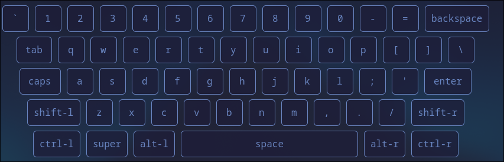
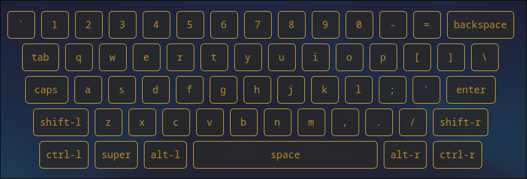
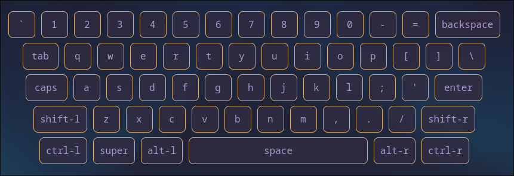
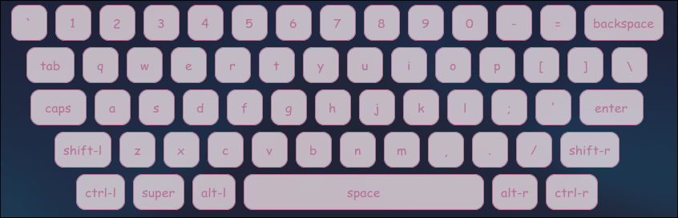

# Keyboard Overlay

A customizable keystroke overlay widget for Linux that displays your keyboard inputs in real-time. Built with GTK4 and Python.

## ✨ Features

- Real-time keystroke visualization
- Customizable overlay widget with theme support
- Low-latency input detection
- GTK4-based modern interface
- Works well with tiling WMs (e.g., Hyprland)

## 🧰 Requirements

- Python 3.8+
- GTK4
- Linux OS
- Input device access permissions

## 📦 Installation

### From source

1. Clone the repository:
```bash
git clone https://github.com/Maruuu1101110/keyboard-widget.git
cd keyboard-widget
```

2. Install dependencies:
```bash
sh setup.sh
```
3. Run the widget:
```bash
sh run.sh
```

## Usage

You can run the widget via:
```bash
python main.py
```

or 

```bash
sh run.sh
```
### System Config
You can also bind it to your systems config, Hyprland for example:
```bash
#hyprland.conf

bind = $mainMod, K, exec, /path/to/run.sh

# Add rules:
#windowrulev2 = workspace 1, title:^(Keystroke Overlay)$
#windowrulev2 = tile, title:^(Keystroke Overlay)$
windowrulev2 = float, title:^(Keystroke Overlay)$ # default
#windowrulev2 = pin, title:^(Keystroke Overlay)$
windowrulev2 = noinitialfocus, title:^(Keystroke Overlay)$
windowrulev2 = noborder, title:^(Keystroke Overlay)$
windowrulev2 = noblur, title:^(Keystroke Overlay)$
windowrulev2 = noshadow, title:^(Keystroke Overlay)$
```

## 🎨 Configuration

### Themes

To customize the appearance, open or modify any `.css` file in:
`~/.config/keyboard-widget/themes`
You can also create your own theme, just follow the `default.css` layout. 

### Device Configuration
If the `run.sh` can't detect your keyboard device: 

1. Manually check input devices:
```bash
ls -l /dev/input/by-id
```

2. Update `config.json`:
```bash
{
  "device_path": "/dev/input/by-id/your-keyboard-device", #This line
  "theme": "default"
}

```

## 🖼️ Screenshots

Here are a few theme examples:
| Default                             | Gruvbox                             |
| ----------------------------------- | ----------------------------------- |
|  |  |

| Rosé Pine                             | Pastel Dream                                |
| ------------------------------------- | ------------------------------------------- |
|  |  |


## Contributing

Contributions are welcome! Please feel free to submit a Pull Request or open an issue.

## License

This project is licensed under the MIT License - see the [LICENSE](LICENSE) file for details.

## Acknowledgments

- Built with GTK4
- Inspired by various keystroke visualization tools 